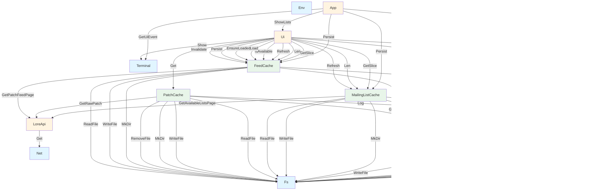

# Actor Dependencies

This document describes the message dependencies between actors in the Patch Hub codebase. Each edge in the diagram represents a distinct message type sent from one actor to another.

## Dependency Diagram

## Legend

- **Blue nodes**: Core system actors (Env, Fs, Log, Net, Shell, Terminal)
- **Orange nodes**: Application actors (Config, Render, LoreApi, App, Ui)
- **Green nodes**: Cache actors (MailingListCache, PatchCache, FeedCache)

## Message Types

### Log Actor Messages
- `Log` - Logs a message (used by info, warn, error methods)

### Config Actor Messages
- `GetLogLevel` - Get the current log level
- `GetUSize` - Get a numeric configuration value
- `GetPath` - Get a path-based configuration value
- `GetRenderer` - Get renderer configuration

### Fs Actor Messages
- `ReadFile` - Open a file for reading
- `WriteFile` - Open a file for writing
- `AppendFile` - Open a file for appending
- `RemoveFile` - Remove a file
- `ReadDir` - Read directory contents
- `MkDir` - Create directory and parents
- `RmDir` - Remove directory

### Shell Actor Messages
- `Execute` - Execute an external program

### Net Actor Messages
- `Get` - HTTP GET request
- `Post` - HTTP POST request
- `Put` - HTTP PUT request
- `Delete` - HTTP DELETE request
- `Patch` - HTTP PATCH request

### LoreApi Actor Messages
- `GetPatchFeedPage` - Get patch feed page
- `GetAvailableListsPage` - Get available lists page
- `GetAvailableLists` - Get all available lists
- `GetPatchHtml` - Get patch HTML content
- `GetRawPatch` - Get raw patch content
- `GetPatchMetadata` - Get patch metadata

### Terminal Actor Messages
- `Show` - Render a screen
- `GetUiEvent` - Get next UI event
- `ClearUiEvents` - Clear UI events queue
- `Quit` - Quit the terminal

### Ui Actor Messages
- `ShowLists` - Show mailing lists view
- `ShowFeed` - Show patch feed view
- `ShowPatch` - Show patch content view
- `UpdateSelection` - Update selection index
- `PreviousPage` - Navigate to previous page
- `NextPage` - Navigate to next page
- `NavigateBack` - Navigate back
- `SubmitSelection` - Submit current selection
- `GetState` - Get current UI state

### MailingListCache Actor Messages
- `Get` - Get a mailing list by index
- `GetSlice` - Get a slice of mailing lists
- `Refresh` - Refresh cache from API
- `Invalidate` - Invalidate cache
- `IsAvailable` - Check if range is available
- `Len` - Get cache length
- `Persist` - Persist cache to disk
- `Load` - Load cache from disk

### PatchCache Actor Messages
- `Get` - Get a patch by list and message ID
- `Invalidate` - Invalidate a specific patch
- `IsAvailable` - Check if patch is available

### FeedCache Actor Messages
- `Get` - Get patch metadata by index
- `GetSlice` - Get a slice of patch metadata
- `Refresh` - Refresh cache from API
- `Invalidate` - Invalidate cache
- `IsAvailable` - Check if range is available
- `Len` - Get cache length
- `Persist` - Persist cache to disk
- `Load` - Load cache from disk
- `IsLoaded` - Check if cache is loaded
- `EnsureLoaded` - Ensure cache is loaded from disk

### App Actor Messages
- `Shutdown` - Shutdown the application

## Notes

1. Messages are traced from each actor's `init()` method and all methods called from `init()` (directly or indirectly).

2. The diagram shows one edge per distinct message type. For example, `Log` actor's `info()`, `warn()`, and `error()` methods all send the same `Log` message type with different log levels, so there is only one edge from actors to `Log`.

3. Some actors don't send messages to other actors (they only receive):
   - `Env` - Only receives messages
   - `Fs` - Only receives messages
   - `Net` - Only receives messages

4. Actors that don't appear in the diagram as targets of edges are terminal actors that don't receive messages from other actors, or they receive messages but those sending actors aren't part of the dependency graph from `init()` methods.
